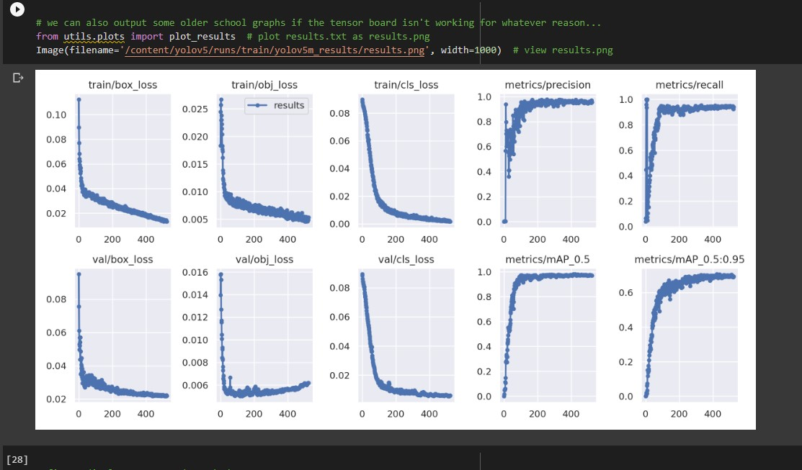
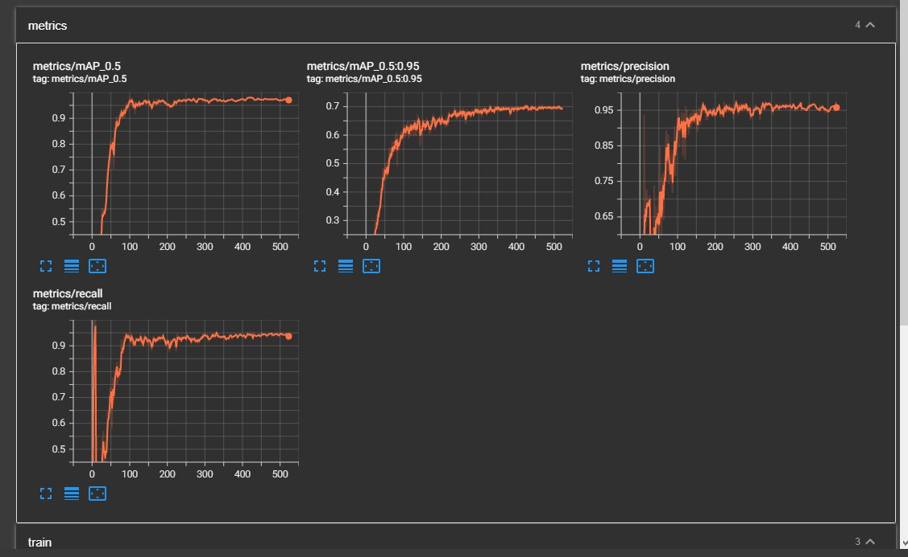
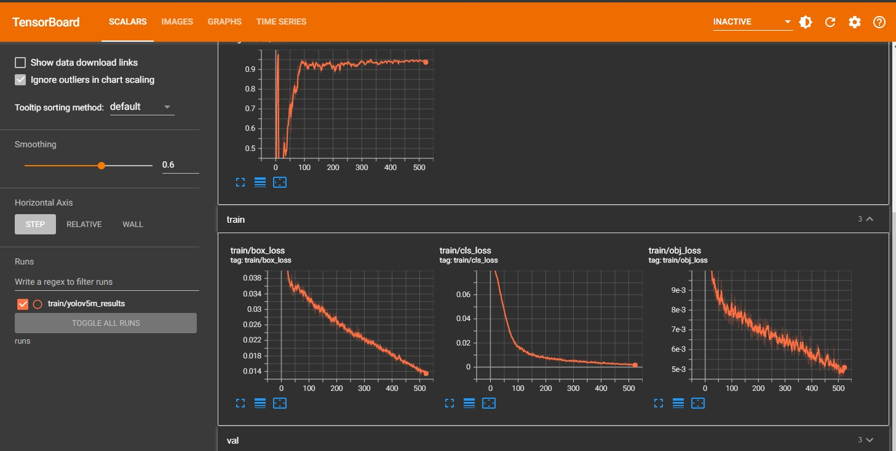
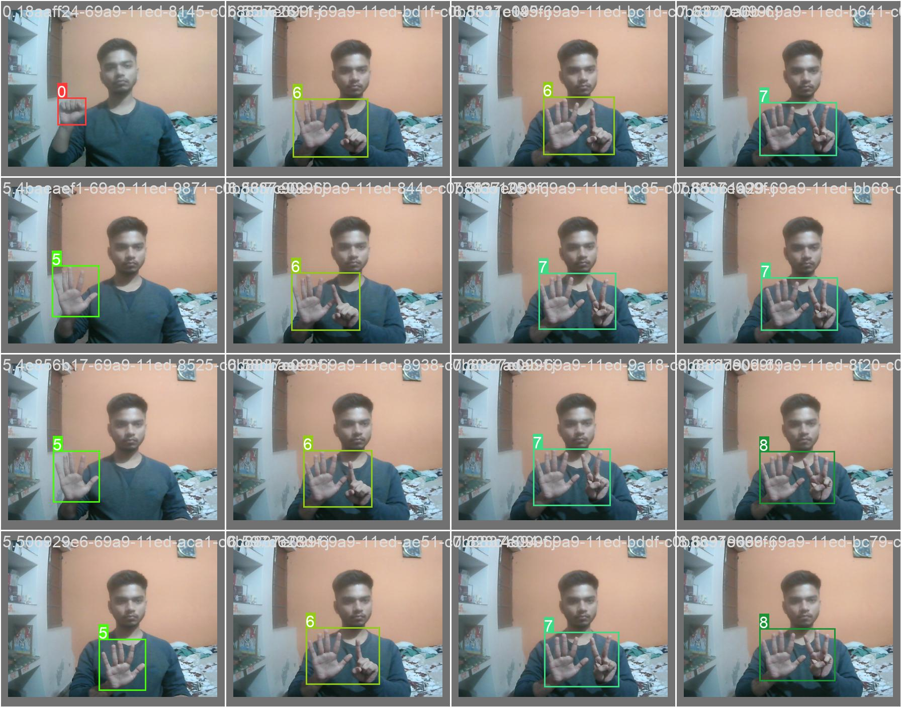
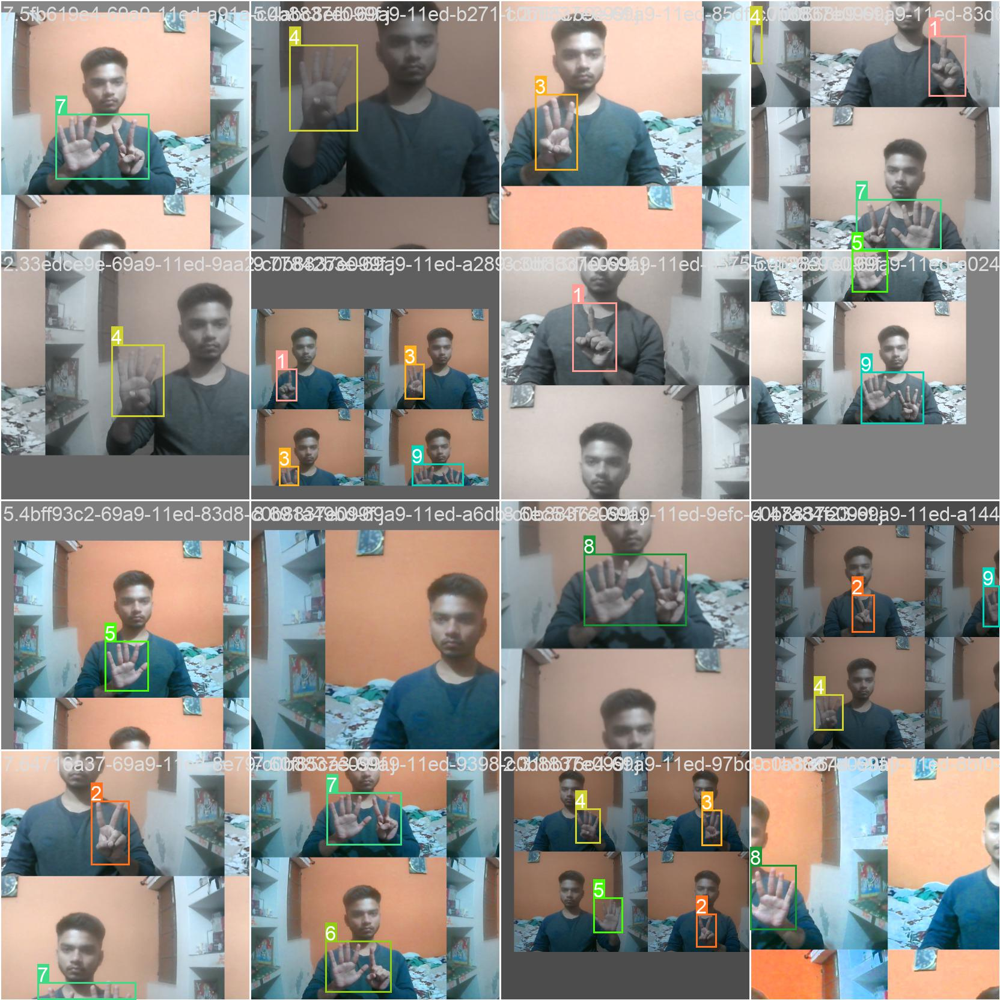

# hand_digit_YOLOv5

Notebook Description 📄

❄️ Trained YOLOv5 model for understanding hand signals for digits

### Jupyter Notebook: (https://github.com/shiv0112/hand_digit_YOLOv5/blob/main/hand_digit_YOLOv5.ipynb)

# How To Run:
### On GoogleCollab
```bash

1) Open the 'Sign_Language_detection_yolov5.ipynb' on Google Collab
2) Just run every shell

```

### On local system
```bash
git clone https://github.com/ultralytics/yolov5.git
```
```bash
extract 'yolov5.zip' and replace the orignal cloned 'yolov5' content
```
```bash
### For Prediction:
python detect.py --weights ./yolov5/runs/train/yolov5m_results/weights/best.pt --img 416 --conf 0.5 --source ./Data/test/images
```
```bash
### For Training:
python train.py --img 416 --batch 16 --epochs 580 --data './Data/data.yaml' --cfg ./yolov5/models/custom_yolov5m.yaml --weights 'yolov5m.pt'  --name yolov5m_results  --cache
```

### Evaluation Metrices:
 <table>
  <tr>
    <td>Result Graph After Training:</td>
  </tr>
  <tr>
    <td></td>
  </tr>
 </table>

### Tensorflow log/ Metric Graph:
 <table>
  <tr>
    <td>Tensorflow log: Metric</td>
    <td>Tensorflow log: Train</td>
  </tr>
  <tr>
    <td></td>
    <td> </td>
  </tr>
 </table>

  # Batch Representation:
 <table>
  <tr>
    <td>Train Data With Ground Truth</td>
  </tr>
  <tr>
    <td></td>
  </tr>
 </table>

### Augmented Batch Representation:

<table>
  <tr>
    <td>Mosaic Augmentation applied</td>
  </tr>
  <tr>
    <td></td>
  </tr>
 </table>

# Working Demo


```bash
Author : Shivansh Srivastava
Contact: srivastavashiv0112@gmail.com
```


